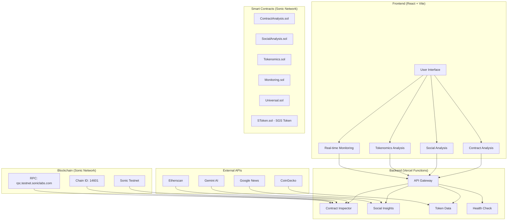
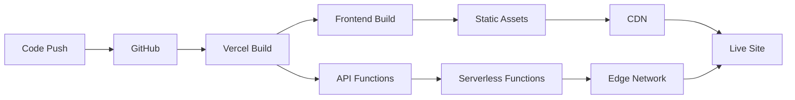
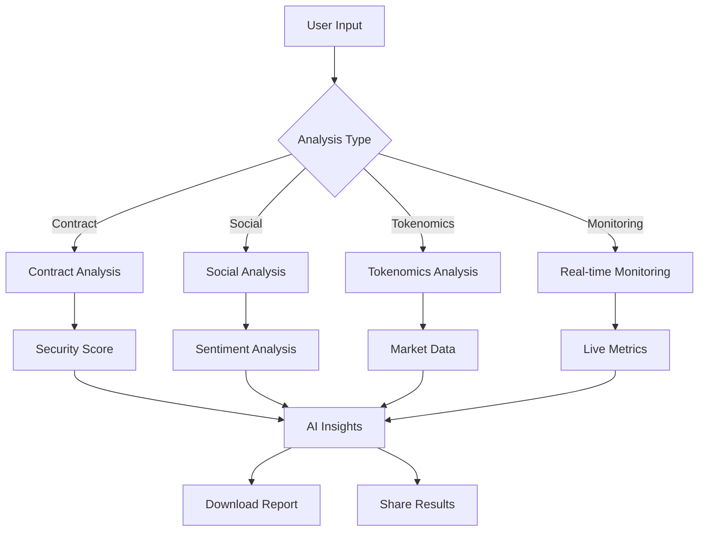

# SonicGuardian

<div align="center">
  <video width="800" height="450" autoplay loop muted style="border-radius: 10px; box-shadow: 0 4px 20px rgba(0,0,0,0.3);">
    <source src="https://raw.githubusercontent.com/ombaviskar18/SonicGaurdian/main/frontend/public/logos/herovideo.mp4" type="video/mp4">
    Your browser does not support the video tag.
  </video>
  
  **🚀 DeFi Security & Analysis Platform on Sonic Network**
  
  *Real-time contract analysis, social sentiment tracking, and automated monitoring powered by SGS tokens*
  
  [](https://soniclabs.com)
  [](https://reactjs.org)
  [](https://vercel.com)
  [](LICENSE)
  [](https://testnet.soniclabs.com)
</div>

## 🚀 Features

| Feature | Description | Cost |
|---------|-------------|------|
| 🔍 **Contract Analysis** | Smart contract security audit, risk assessment, ABI analysis with AI insights | 1 SGS Token |
| 📊 **Social Analysis** | Real-time news integration, sentiment analysis, SWOT analysis, Telegram bot alerts | 1 SGS Token |
| 📈 **Tokenomics Analysis** | Market data, supply analysis, whale tracking, portfolio analysis | 1 SGS Token |
| ⚡ **Real-time Monitoring** | Live token tracking, price alerts, AI predictions, interactive charts | 1 SGS Token |
| 💬 **Universal Messaging** | Cross-chain messaging and communication system | 1 SGS Token |
| 🎨 **Modern UI/UX** | Responsive design, print reports, mobile optimized, real-time updates | Free |

## 🏗️ Architecture



## 🛠️ Tech Stack

| Layer | Technology |
|-------|------------|
| **Frontend** | React 19, TypeScript, Vite, Framer Motion, Chart.js |
| **Backend** | Node.js, Express.js, Vercel Functions, Axios |
| **Blockchain** | Sonic Network (Chain ID: 14601), Solidity 0.8.26, Hardhat, Ethers.js |
| **Token System** | SGS Token (ERC-20), 1 token per feature, MetaMask integration |
| **APIs** | Google News, CoinGecko, Gemini AI, Telegram Bot |
| **Deployment** | Vercel, GitHub Actions |

## 🚀 Quick Start

### **Prerequisites**
- Node.js 18+
- MetaMask wallet
- Sonic Testnet S tokens (for gas fees)
- SGS tokens (for feature usage)
- API keys (see [Setup Guide](VERCEL_ENV_SETUP.md))

### **Installation**
```bash
# Clone & install
git clone https://github.com/ombaviskar18/SonicGaurdian.git
cd SonicGaurdian
npm install
cd frontend && npm install
cd ../api && npm install

# Start development
npm run dev --prefix frontend  # Frontend
npm run server                 # Backend
```

### **SGS Token Setup**
1. **Add SGS Token to MetaMask:**
   - Contract Address: `0x7ba0f1BA2F61aB8190200C20b7755C56292C5728`
   - Symbol: `SGS`
   - Decimals: `18`

2. **Get SGS Tokens:**
   - Each feature costs exactly 1 SGS token
   - Contact deployer for initial SGS tokens
   - Native S tokens used only for gas fees

### **Live Demo**
🌐 **[https://sonic-guardian.vercel.app](https://sonic-guardian.vercel.app)**

## 🌐 Deployment

### **Vercel Deployment**
```bash
# Deploy to production
vercel --prod

# Deploy to preview
vercel
```

### **Environment Setup**
⚠️ **Required**: Configure environment variables in Vercel dashboard
- See [Setup Guide](VERCEL_ENV_SETUP.md) for detailed instructions
- Run `node test-api.js` to verify API functionality

### **Deployment Workflow**



### **Smart Contracts**
```bash
# Compile contracts
npx hardhat compile

# Deploy to Sonic Testnet
npx hardhat run scripts/deploy-sonic.ts --network sonic

# Test contracts
npx hardhat run scripts/test-contracts.ts --network sonic
```

### **Deployed Contract Addresses (Sonic Testnet)**
```
SToken (SGS): 0x7ba0f1BA2F61aB8190200C20b7755C56292C5728
ContractAnalysis: 0x3a0B68b62Ae686D49cFe4ED15F903337557A26a4
Tokenomics: 0x48a471675A98FB98e70989C55c785aaFd75Aa67a
SocialAnalysis: 0xa4916233f1FF28C638E987a1bDc8d03bDdf92d98
Monitoring: 0x3523675708a44f68e19B390471a5ddC87E985f06
Universal: 0xaa71b81373d21496073c089c7D54a24b28CD1e1b
```

## 📱 Usage

### **User Workflow**



### **Quick Actions**
- 🔍 **Contract Analysis**: Enter address → Pay 1 SGS → Get security score
- 📊 **Social Analysis**: Enter symbol → Pay 1 SGS → View sentiment & news
- 📈 **Tokenomics**: Enter token → Pay 1 SGS → Analyze supply & metrics
- ⚡ **Monitoring**: Enter token → Pay 1 SGS → Track live data
- 💬 **Universal Messaging**: Send message → Pay 1 SGS → Cross-chain communication

### **SGS Token Economics**
- **Total Supply**: 1,000,000 SGS tokens
- **Feature Cost**: 1 SGS token per analysis
- **Gas Fees**: Paid in native S tokens
- **Token Standard**: ERC-20 compatible
- **Network**: Sonic Testnet (Chain ID: 14601)

## 🔧 Configuration

### **API Keys Required**
| Service | Setup Link | Purpose |
|---------|------------|---------|
| **Google News** | [Cloud Console](https://console.cloud.google.com) | News aggregation |
| **CoinGecko** | [CoinGecko API](https://www.coingecko.com/en/api) | Market data |
| **Gemini AI** | [AI Studio](https://makersuite.google.com/app/apikey) | AI insights |
| **Telegram Bot** | [@BotFather](https://t.me/botfather) | Automated alerts |

### **API Endpoints**
- `GET /api/health` - Health check
- `GET /api/inspect` - Contract analysis
- `GET /api/social/insights` - Social analysis
- `GET /api/token/total-supply` - Token data

## 🔒 Security & Benefits

### **Security Features**
- 🔍 Smart contract auditing & vulnerability detection
- 📊 Comprehensive risk scoring & assessment
- ⚡ Real-time monitoring & threat detection
- 🤖 AI-powered security insights
- 🌐 Sonic Network native security analysis
- 💰 SGS token-based access control
- 🔒 Pausable contracts for emergency stops

### **Key Benefits**
| User Type | Benefits |
|-----------|----------|
| **Investors** | Risk assessment, portfolio monitoring, market insights |
| **Developers** | Contract auditing, cross-chain analysis, API access |
| **Analysts** | Comprehensive data, AI insights, report generation |

## 🤝 Contributing

1. Fork the repository
2. Create feature branch (`git checkout -b feature/amazing-feature`)
3. Commit changes (`git commit -m 'Add amazing feature'`)
4. Push to branch (`git push origin feature/amazing-feature`)
5. Open Pull Request

## 📄 License

This project is licensed under the MIT License - see the [LICENSE](LICENSE) file for details.

## 🆘 Support

- 📚 **Documentation**: Check code comments and inline docs
- 🐛 **Issues**: Report bugs via [GitHub Issues](https://github.com/ombaviskar18/SonicGaurdian/issues)
- 💬 **Discussions**: Join community discussions
- 📱 **Telegram**: [@Social_Alertbot](https://t.me/Social_Alertbot)

## 🚀 Roadmap

- [x] **Sonic Network Migration** - Complete migration from ZetaChain to Sonic
- [x] **SGS Token System** - ERC-20 token for feature payments
- [x] **Smart Contract Deployment** - All contracts deployed to Sonic Testnet
- [ ] **Advanced AI Models** - Enhanced predictions and analysis
- [ ] **Sonic Mainnet Support** - Deploy to Sonic mainnet when available
- [ ] **Native Mobile Application** - iOS and Android apps
- [ ] **API Marketplace** - Third-party integrations and plugins
- [ ] **Enterprise Features** - Institutional-grade security tools
- [ ] **Cross-chain Expansion** - Support for additional EVM chains
- [ ] **SGS Token Staking** - Earn rewards by staking SGS tokens

---

<div align="center">
  **Built with ❤️ on Sonic Network**
  
  *SonicGuardian - Your DeFi Security Companion*
  
  **🌐 Network**: Sonic Testnet (Chain ID: 14601)  
  **💰 Token**: SGS (0x7ba0f1BA2F61aB8190200C20b7755C56292C5728)  
  **🚀 Live Demo**: [sonic-guardian.vercel.app](https://sonic-guardian.vercel.app)
  
  [](https://github.com/ombaviskar18/SonicGaurdian)
  [](https://github.com/ombaviskar18/SonicGaurdian)
  [](https://github.com/ombaviskar18/SonicGaurdian/issues)
</div>
